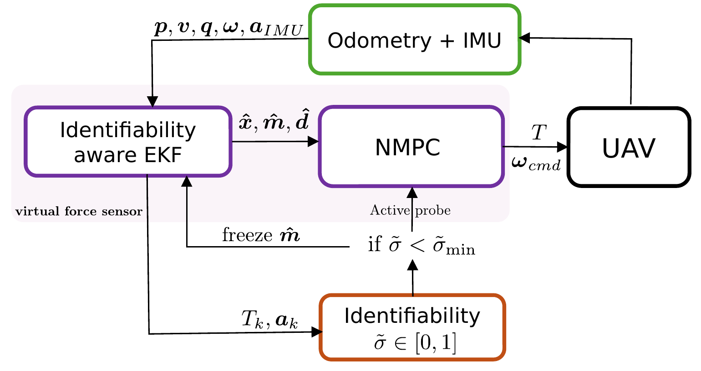
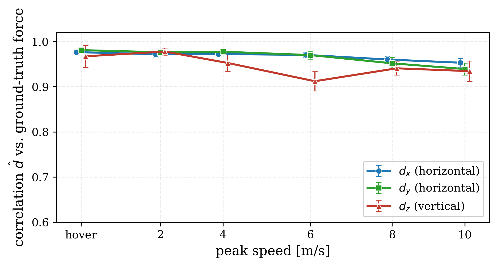
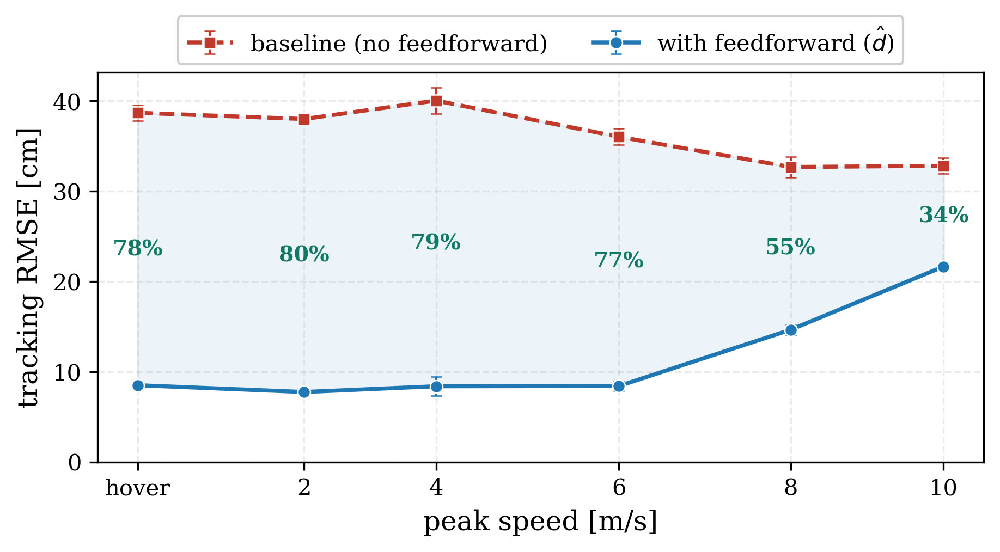
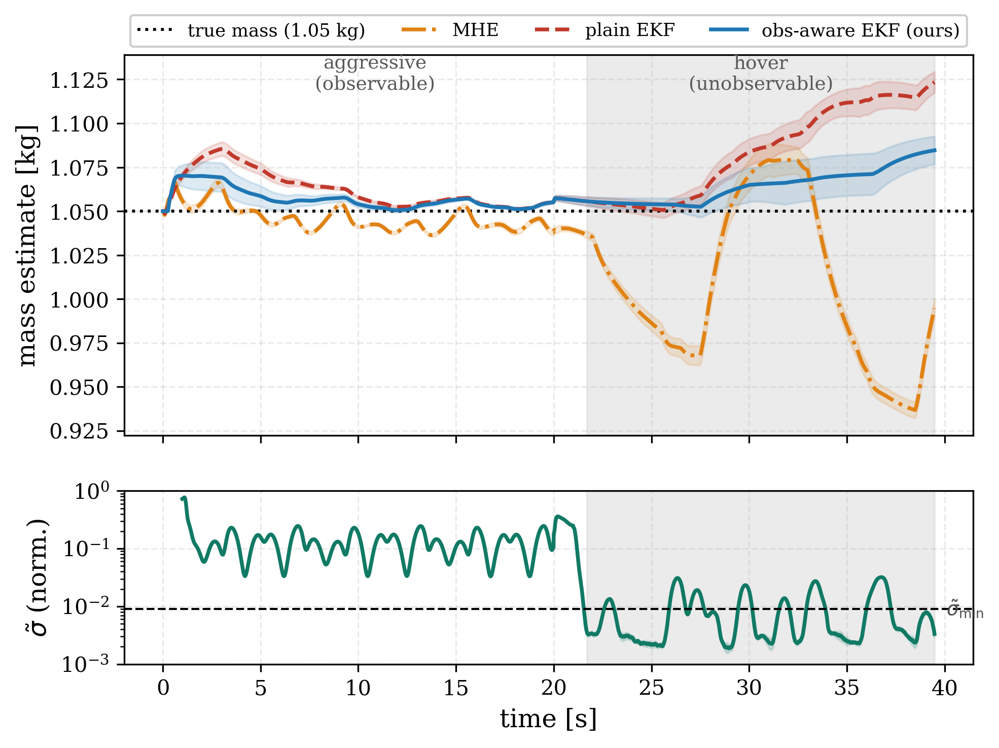
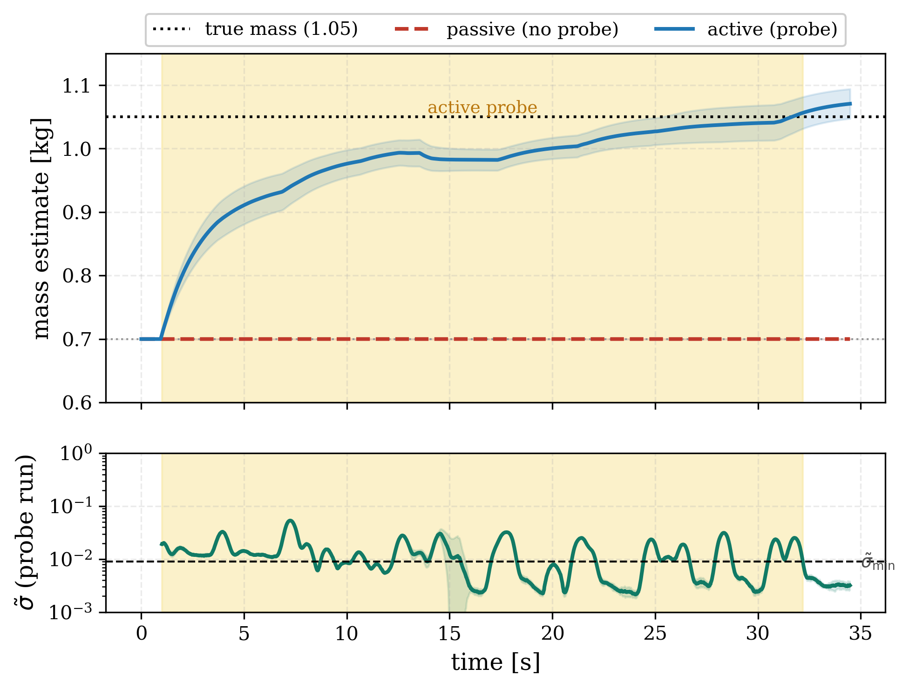
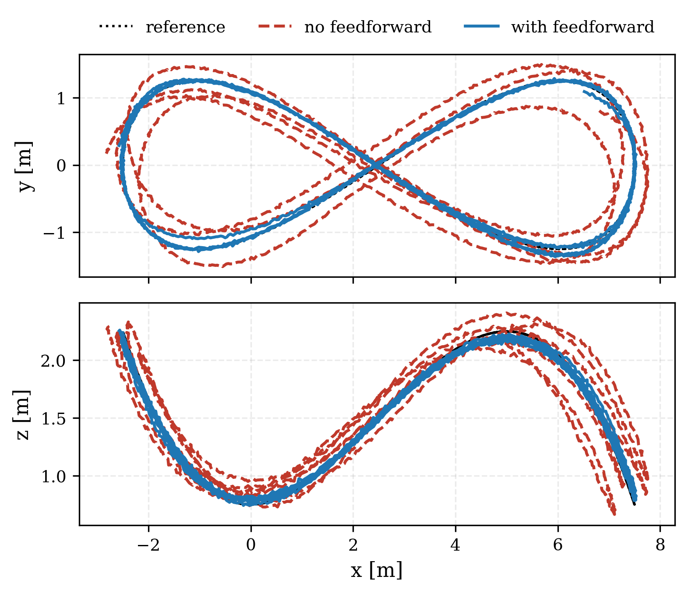
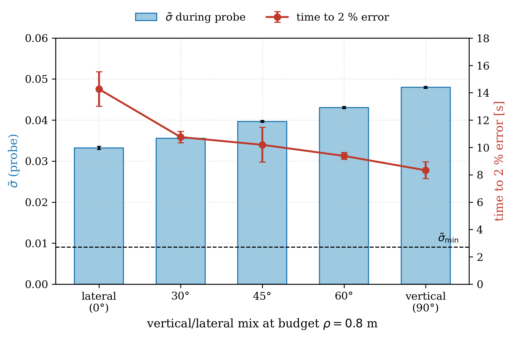

# Identifiability-Aware Virtual Force Sensing and Self-Calibration for Quadrotors


A quadrotor rarely carries a force sensor, but flying in wind or carrying a
payload needs the external force. This repository turns the onboard **IMU into
a virtual force sensor**, makes it **self-calibrating**, and closes the loop by
feeding the sensed force to an NMPC as feedforward.

<p align="center">
  
</p>

The reading itself is simple — the external force is the accelerometer residual
of the flight estimator. The obstacle is **calibration**: the residual gives
force only if the mass is known, and near hover the mass is **unidentifiable**
— a vertical force and a mass change produce the same measurement, so a
standard EKF quietly corrupts the mass and, with it, the force. This code
resolves that with one signal used three ways.

## Contributions

1. **Virtual force sensor.** The external specific force read directly from the
   accelerometer residual: vector, instantaneous, valid at zero velocity
   (unlike an energy balance), no extra hardware.
2. **Closed-form identifiability test.** The marginal Fisher information on the
   mass — a Schur complement over a 1-s sliding window of thrust and attitude —
   isolates exactly the mass–vertical-force coupling. Provably zero in
   stationary hover; its inverse is the Cramér–Rao bound on the mass.
3. **Identifiability gate.** While the normalized signal `σ̃` is below the
   threshold (0.009, plus a dwell), the mass update is frozen and the force
   keeps being estimated. The same scalar separates "the data can support
   calibration" from "it cannot".
4. **Minimal active probe.** When the mass is needed and the flight cannot
   identify it, the controller injects a bounded excursion of the position
   reference (budget 0.8 m; not a sensor), triggered *and shaped* by the same
   measure — a vertical bob is provably and empirically the most informative —
   and withdraws it after 15 s of gate-open time.

## Results (MuJoCo SiL, 100 Hz, noisy odometry + wind with ground truth)

| Claim | Result |
|---|---|
| Force from IMU vs. ground truth | per-axis correlation **0.93** under continuous wind |
| Gate holds mass through windy hover | **3%** error vs **7%** for the ungated EKF |
| Passive identification under excitation | 0.60 kg prior (43% low) → **0.6%** error |
| Probe recovery in hover | 0.70 kg prior → **0.4 ± 0.2%** (N=5); hover alone identifies nothing |
| Sensed force → NMPC feedforward | **34–80%** less tracking error under wind, most where wind dominates |
| Robustness | graceful degradation under injected accelerometer bias/scale and thrust-map errors |
| Runtime | estimator + controller at 100 Hz, <1 ms per step (laptop-class CPU) |

Force estimate vs. ground truth | Disturbance rejection (feedforward on/off)
:---:|:---:
 | 
**Gated vs. plain EKF** (windy maneuver→hover) | **Probe recovers the mass** (wind-free hover)
 | 
**Trajectory under wind** (with/without feedforward) | **Probe shaping** (σ̃ predicts settling time)
 | 

## How it works

1. **Reading.** `d = R·a_imu − (T/m)·R e₃`, in the world frame. Everything on
   the right is measured or known — except the mass.
2. **Identifiability test.** Over a 1-s window, the normalized Schur complement
   `σ̃` of the information matrix measures whether the mass is separable from a
   vertical force. Zero in hover (Proposition 1 of the paper); grows with the
   dispersion of the thrust vectors.
3. **Gate.** `σ̃ < σ̃_min` ⇒ mass frozen, force still estimated. The ungated
   EKF instead trades mass error for force error exactly where the force
   matters most. A 100-run sensitivity battery (window, dwell, process noise,
   accelerometer noise, maneuver intensity) maps where the gate helps and where
   it is unnecessary.
4. **Probe.** If the mass is needed while `σ̃` stays low, a lateral-circle /
   vertical-bob reference excursion within a 0.8-m budget raises `σ̃` above
   threshold; higher achieved `σ̃` ⇒ faster mass settling (8.3 s vertical vs
   14.3 s lateral, p = 0.004). Withdrawn after 15 s of gate-open time; the mass
   holds for the rest of the flight.
5. **Feedforward.** The smoothed force enters the NMPC prediction model
   (`v̇ = (T/m̂)·R e₃ + d̂ + g`), so the controller anticipates the wind instead
   of only reacting to it. Mass and `d̂` are runtime solver parameters — no
   rebuild.

The estimator of record is an **EKF**: a matched moving-horizon estimator
(same models, full nonlinear window) does not improve on it, because the model
is nearly linear in the estimated states — the paper quantifies the
linearization error and the scenarios where that would change.

## Paper

*Identifiability-Aware Virtual Force Sensing and Self-Calibration for
Quadrotors* — under review at **IEEE Access** (manuscript Access-2026-36061).

- LaTeX sources: [`paper/`](paper/) (manuscript, highlighted revision, and
  point-by-point response letter, all compilable).
- Every number, figure, and table in the manuscript is generated by the code
  and scripts in this repository; the battery scripts below are the exact ones
  used for the paper.

## Requirements

- ROS 2 Humble
- [acados](https://github.com/acados/acados) (generated C code included under
  `c_generated_code_*`; regenerate with `ocp_generation/*.py` only if the
  formulation changes)
- Eigen 3
- MuJoCo simulator workspace (`~/mujoco_ws`) with the MujocoRosUtils plugin —
  the paper's data are reproduced with the plugin state committed 2026-06-18
  (`mujoco_ws` commit `31ef534`)
- Python 3 + numpy/matplotlib for the analysis scripts

## Build

```bash
cd build
source /opt/ros/humble/setup.bash
source ~/mujoco_ws/install/setup.bash
cmake --build . --target nmpc_mhe_sil -j$(nproc)
```

## Reproduce

Start the noisy scene + wind node (publishes ground truth on
`/quadrotor/external_force`) in another terminal:

```bash
MUJOCO_ODOM_NOISE=1 sim_gate_collideroff
```

Single runs (from `build/`):

```bash
./nmpc_mhe_sil v2 60 w=2.0          # force sensing (known mass)
./nmpc_mhe_sil v2 60 w=2.0 ff       # + feedforward d̂ → NMPC (rejection)
./nmpc_mhe_sil v2 60 w=2.0 idmass   # wrong mass prior → identification
./nmpc_mhe_sil v2 60 hover ff       # windy hover (max rejection)
```

`v1` = open loop (fixed wrong mass), `v2` = closed loop. The NMPC tracks a
fixed time reference, so any tracking change is the estimator alone — a clean
ablation.

Paper batteries (each = one experiment group; every run resets and verifies the
simulator before flying, and aborts rather than relaunching a broken sim):

| Script | Experiment | Paper output |
|---|---|---|
| `scripts/batch_rejection.sh` | speeds × {ff, baseline} | Figs. 10–12 (rejection) |
| `scripts/batch_trans.sh` | gated vs plain EKF, maneuver→hover | Fig. 7 |
| `scripts/batch_active50.sh` | probe vs passive recovery, 50-s runs | Fig. 8 |
| `scripts/batch_probe_sweep08.sh` | probe shape sweep at 0.8-m budget | Fig. 9 |
| `scripts/batch_robust.sh` | accel bias/scale + thrust error sweep | Fig. 13 |
| `scripts/batch_sens.sh` | gate sensitivity, 100 runs, one knob at a time | Table 7 |

Analysis/plotting: `scripts/analyze_*.py` and `scripts/plot_*.py` read the CSVs
from `results/` and write the figures used in `paper/figs/`.

Environment knobs: `ACCEL_NOISE` (accelerometer noise level),
`PROBE_OPEN_TIME` (gate-open seconds before probe withdrawal),
`EKF_WIN` / `EKF_DWELL` / `EKF_RS` (gate window, dwell, measurement noise).

## Layout

```
src/mhe/            EKF + MHE estimators (EKF baseline in include/quadrotor_mpc/mhe/)
src/nmpc/           adaptive NMPC + SiL driver
src/mujoco/         MuJoCo SiL interface + reset/verify protocol
ocp_generation/     acados OCP definitions (Python) → c_generated_code_*
scripts/            batch_*.sh runners, analyze_*.py / plot_*.py
paper/              LaTeX sources (manuscript, highlighted version, response letter)
results/            run CSVs + generated figures (gitignored)
docs/figs/          figures shown in this README
```

## Scope and honest limits

- Everything is software-in-the-loop; **hardware validation is future work**
  and the paper claims none.
- The force is estimated in the world frame; a body-fixed disturbance (drag at
  speed) is tracked only within the random-walk bandwidth.
- Transfer of the gate threshold to other vehicles, thrust-to-weight ratios,
  and IMU grades is not established by one simulated platform — the
  sensitivity battery states the operating region explicitly.

## Citation

```bibtex
@article{varelaaldas2026identifiability,
  title   = {Identifiability-Aware Virtual Force Sensing and Self-Calibration
             for Quadrotors},
  author  = {Varela-Ald{\'a}s, Jos{\'e} and Quito, Ang{\'e}lica and
             Andaluz, V{\'i}ctor H. and Brand{\~a}o, Alexandre Santos},
  journal = {IEEE Access (under review)},
  year    = {2026}
}
```
